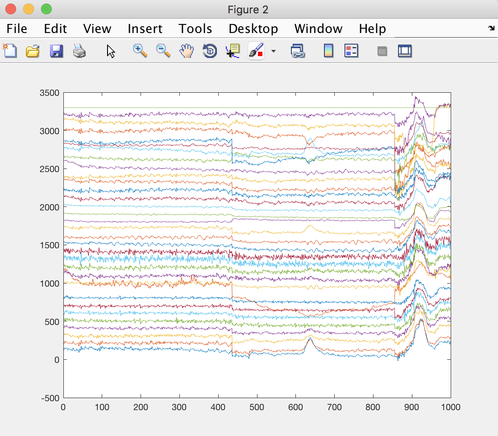
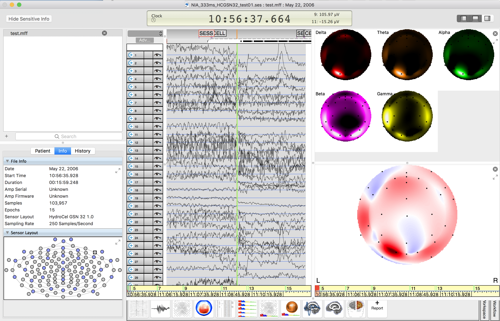

MFFMatlabさん IO は、FieldTrip の MFF ファイルのデフォルトインポートプログラムです。

最新バージョンをダウンロード [FieldTrip](http://www.fieldtriptoolbox.org/download)

それから、[MFFMatlabIO リポジトリ](https://github.com/sccn/mffmatlabio)を参照し、任意の MFF テストファイルを準備して解凍してください。 MATLABセッションを開始

FieldTrip のメインフォルダーがパスにあり、そのフォルダーが _NIA_333ms_HCGSN32_test01.mff_ (上記のダウンロード済み) が現在の MATLAB パスにあることを確認してください。 MATLABコマンドラインタイプ

```matlab
hdr = ft_read_header(fullfile(pwd, 'NIA_333ms_HCGSN32_test01.mff'));
events = ft_read_event(fullfile(pwd, 'NIA_333ms_HCGSN32_test01.mff'), 'header', hdr);
data = ft_read_data(fullfile(pwd, 'NIA_333ms_HCGSN32_test01.mff'), 'header', hdr);
```

データのプロットとチェック

```matlab
figure; plot(data(:,1:1000)' + repmat([1:size(data,1)]*100, [1000 1]));
```



データをMFF形式に戻す

```matlab
ft_write_data(fullfile(pwd, 'test.mff'), data, 'header', hdr, 'event', events, 'dataformat', 'mff');
```

ネットステーションに戻ってインポート


