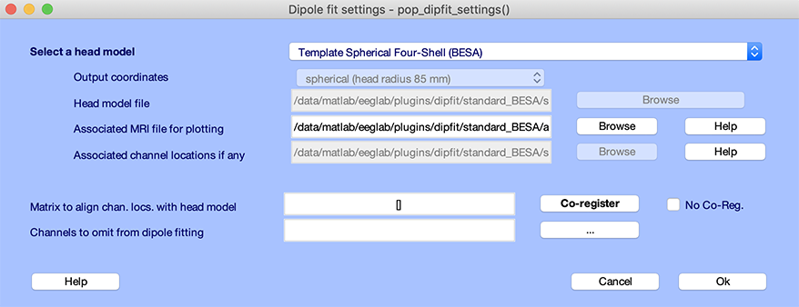
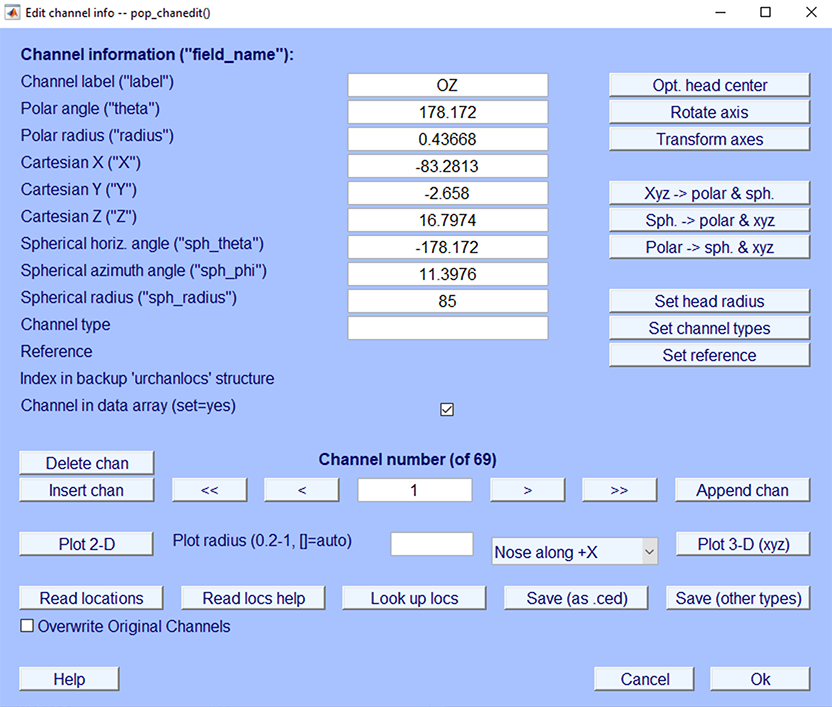
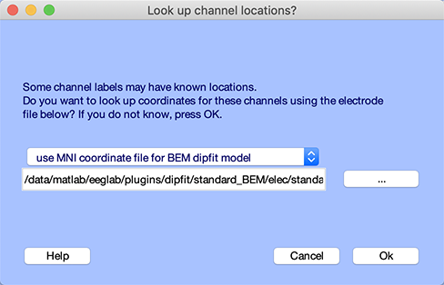
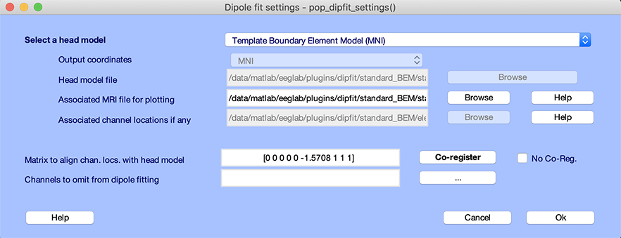
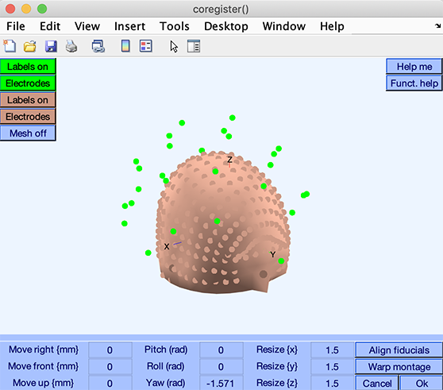
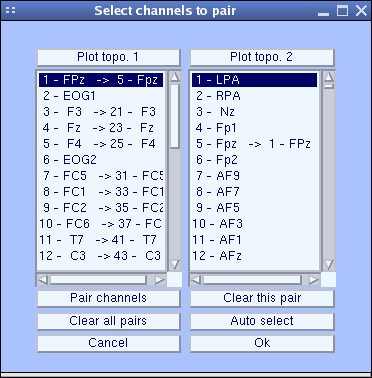
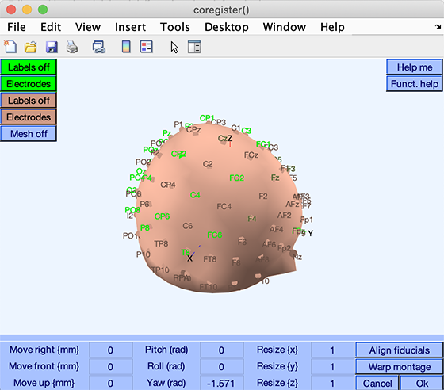
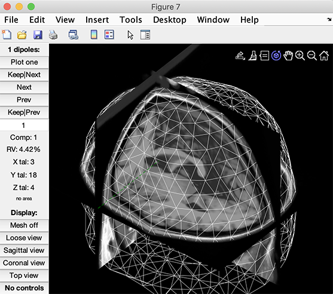

  

    目次
  

  {: .text-delta }
- TOC
{:toc}

# 基本に戻る

ソースローカリゼーションを実行するには、以下の3つが必要です。

1. **ヘッドモデル**（電気または磁場が頭部を通る伝搬方法を記述するモデル）
     * 異なる導電率を持つ同心球で構成されたシンプルなモデル
     * 皮質表面、頭蓋骨、頭皮を記述する幾何学的3次元メッシュから成るより複雑なモデル（Boundary Element Model: BEM）。これらの境界面での導電率の変化もモデル化されます。
     * Finite Element Model (FEM) は、各ボクセルの電圧の伝搬を計算する、より精密なモデルです。
2. **ソースモデル**（脳内の電流源の生成方法）
     * 単一ダイポール
     * 3Dグリッド上の分散ソースモデル（例: [eLORETA](https://doi.org/10.1098/rsta.2011.0081)）
     * 皮質表面に分散するダイポール。例えば、皮質表面にダイポールの方向を制約する場合があります。
3. EEGまたはMEG **センサー**の位置とヘッドモデルおよびソースモデルとの関係

3つすべてが揃うと、ソースのアクティビティを推定するためのアルゴリズムが必要です。残念ながら、頭皮表面で観察されたアクティビティを生成できるソース分布は無限に存在するため、ソースに制約を課す必要があります。制約の例:

* 単一のダイポールでスカルプ活動をモデル化する。この方法では、通常、一意の最適解が得られます。
* ソースの滑らかさを仮定し、隣接するソースが相関するように制約する。
* [ビームフォーミング](https://doi.org/10.1109/10.623056)を使用する。
* その他のソース活動に対する制約...

ヘッドモデル、ソースモデル、センサー位置の3つが揃うと、各ソースから各センサーへの信号伝搬を記述する *source × EEGチャンネル* の **リードフィールド行列** を計算できます。この行列を用いて、フォワードモデルを構築し、逆問題を解くことが可能になります。

# ヘッドモデルの選択

ソースローカリゼーション は、 この例では、EEGLABのヘッドモデルを実装しています。 次の記事を読んでください。
<!-- Second, choosing a source model: The source model is the type of source you will use. This may be a single dipole, which position you optimize. This could also be  -->
<!-- a distributed model, with one dipole per brain voxel, such as when using Loreta. The source model is independent of the head model. Third, you will perform inverse source localization and plot the source results. -->

## DIPFITヘッドモデルの設定

このセクションでは、チュートリアルデータセットを使用します。 [データエポック抽出](/tutorials/07_Extract_epochs/Extracting_Data_Epochs.html)を参照してください。 メニュー項目を選択 ファイル サブメニュー項目を押します
既存のデータセットをロードするEEGLABの「sample_data」フォルダにある「eeglab_data_epochs_ica.set」のチュートリアルファイルです。

DIPFIT は、EEGLABのデフォルトのダイポールフィッティングプラグインです。EEGLABでは、DIPFITを主要なソースローカリゼーションツールとして導入しています。

DIPFITのヘッドモデルを設定するには、EEGLABのメニュー項目  DIPFIT → ヘッドモデルと設定を選択します。 以下のウィンドウが表示されます。

上部の編集ボックス、*モデル（選択するためにクリック）*は、頭部のタイプを指定します。球面モデル、またはカスタムモデルを選択できます。 

※4層（頭蓋骨、頭皮、CSF、皮質）の球面モデルを使用してモデル化します。[詳しくはこちら](https://github.com/sccn/sccn.github.io/files/10201215/DIPFIT.vs.BESA.study.using.the.spherical.head.model.pdf).

**テンプレートBEMモデル** は、MNI (Montreal Neurological Institute) の標準脳から抽出されたモデルです。3層（頭蓋骨、頭皮、皮質）のメッシュで構成されています。同心球モデルよりも現実的で、高速な結果が得られます。BEMモデルについて[詳しくはこちら](https://pubmed.ncbi.nlm.nih.gov/11222970/)を参照してください。DIPFITでは、FieldTripの *ft_read_headmodel('standard_bem.mat')* を使用してBEMモデルを読み込みます。BEMモデルの詳細は[こちらの論文](https://pubmed.ncbi.nlm.nih.gov/11222970/)を参照してください。テンプレートMRIの組織セグメンテーションはSPM (1999) を使用して行われています。

**FieldTripのカスタムモデル**: FieldTripは、被験者のMRIからBEMモデルを作成する機能を提供しています。[詳しくはこちら](https://www.fieldtriptoolbox.org/tutorial/headmodel_eeg_bem/)を参照してください。

この例では、*Boundary 要素モデル*（BEM）を選択します。

* *ヘッドモデル* は、ヘッドモデルファイルのパスを指定します。FieldTripのフォーマットに対応しています。
* 編集ボックス *共同登録変換行列* は、チャンネル座標をヘッドモデルの座標系に変換するためのパラメータです。テンプレートヘッドモデルの場合、MNI座標系のランドマーク（Nz、LPA、RPA、Cz (vertex) 電極）を使用して自動的に共同登録変換が計算されます。
* *関連するMRIファイル* は、ダイポールをプロットする際に使用するMRIファイルです。[SPMソフトウェア](https://www.fil.ion.ucl.ac.uk/spm/)を使用してMNI座標系に正規化されたMRIを使用します。
* エントリ *関連するチャンネルの場所* は、ヘッドモデルに関連付けられているテンプレートチャンネル位置ファイルの名前が含まれています。 この情報は、データセットのチャンネルの場所ファイルがテンプレートとは異なる可能性があるため、重要です。 もしそうなら、モデルに関連付けられているテンプレートの場所を使用してチャンネルの位置を合わせるには、共同登録変換が必要です。
* *チャンネル選択* の「*...*」ボタンを押すと、ダイポールフィッティングに使用するチャンネルを選択できます。例えば、非頭皮チャンネル（EOGなど）を除外することで、逆モデルの精度を向上させることができます。

## ヘッドモデルと電極の位置の調整

ヘッドモデルと電極位置のアライメント方法について説明します。

<!-- ### The default headmodels

The first default head model for FieldTrip is a spherical head model. This is the  -->

### テンプレート電極位置の手動共同登録

電極の位置がテンプレート（例えば国際10-20システム）に基づいている場合、ヘッドモデルとの共同登録が必要です。現在のヘッドモデル設定ウィンドウを開きます。
(メニュー項目を選択) 編集 → チャンネルの場所)。 結果のチャンネルエディタウィンドウは以下のとおりです。

BEM DIPFITモデルのMNI座標系ファイル

チャンネルエディタウィンドウで *Ok* を押し、  DIPFIT → ヘッドモデルと設定 ウィンドウに戻ります。EEGLABでは、ヘッドモデルの鼻方向がデータの軸方向と異なる場合があります。共同登録の変換行列は、9つのフィールド *\[shiftx shifty shiftz pitch roll yaw scalex scaley scalez\]* で構成されます。

* 最初の3つの数字 *\[shiftx shifty shiftz\]* は、x、y、z軸方向の平行移動です。
* 次の3つの数字 *\[pitch roll yaw\]* は、ラジアンで表される回転です。 *Yaw* は、Z軸周りの回転を表しています。 *Pitch* および *Roll* は、X および y の軸の回転です。 0 に等しい場合、回転は制御されます。
* 最後の3つの数字 *\[scalex scaley scalez\]* は、x、y、z軸方向のスケーリングです。

この場合は、電極座標とヘッドモデルの座標系の間の90度回転のみのアライメントが必要です。 共同登録・整列が不要の場合、*コアグなし*チェックボックスを選択することもできます。

*詳細は、こちらをご確認ください。

### テンプレート電極位置の共同登録

国際10-20システムの電極位置は、ヘッドモデルの座標系に直接対応していない場合があります。そのため、テンプレート電極位置とヘッドモデルの共同登録が必要です。

繰り返します。  DIPFIT → ヘッドモデルと設定 メニュー DIPFIT画面設定の*Co-register* ウィンドウが開きます。 *resize* 値が 1.5 に値するので、すべての軸が並んでいるように見えます。

ヘッドモデルの表面が電極位置とともに表示されます。電極がヘッドモデルの表面に適切に配置されていることを確認してください。

*Warp*ボタンを押すと、電極位置をヘッドモデルに自動的にワープさせることができます。

チャンネル対応ウィンドウがポップアップ表示されます。

対応するチャンネル名を確認し、必要に応じて修正します。

*Ok*を押すと、共同登録の結果がヘッドモデル設定ウィンドウに反映されます（以下参照）。

<u>手動微調整:</u> 手動で *\[shiftx shifty shiftz pitch roll yaw\]* の値を調整し、電極位置とヘッドモデルの位置合わせを微調整できます。

共同登録が完了したら、DIPFIT設定ウィンドウで*Ok*を押して設定を保存します。

<u>基準点について:</u> 基準点（fiducials: nasion、左右の耳介前点）は、正確な共同登録のために重要です。基準点の詳細は[こちらのスライド](https://sccn.ucsd.edu/eeglab/download/Fiducials.pdf)を参照してください。*EEG.chanlocs* 構造体に基準点の座標を含めることができます。

基準点が利用可能な場合は、*Align fiducials*ボタンを使用して自動的にアライメントを行うことができます。

### デジタル化された電極位置の共同登録

個別にデジタル化された電極位置を使用すると、ソースローカリゼーションの精度を大幅に向上させることができます（[40%以上の改善](https://doi.org/10.3389/fnins.2019.01159)）。3Dデジタイザ（[Polhemus](https://polhemus.com/scanning-digitizing/digitizing-products/) や [Zebris](https://www.zebris.de/en/)）を使って電極の3D位置を測定できます。スマートフォンの3Dスキャナを使用する方法もあり、約5分で完了します。EEGLABの [get_chanlocs プラグイン](https://github.com/sccn/get_chanlocs/wiki)がスマートフォン3Dスキャナからの電極位置取得をサポートしています。

個々の電極位置は通常 `.sfp` ファイルに保存されます。EEGLABの `pop_chanedit` 関数を使用して、GUIから 編集 → チャンネルの場所 を選択し、*Read Location*ボタンで読み込みます。[手動調整プロセス](#manual-co-registration-of-the-template-channel-locations)では、**Align fiducials**オプションのみを使用して共同登録を実行します。

## ヘッドモデルとカスタムMRI

ダイポールソースをプロットする際（[チュートリアルのセクション](/tutorials/09_source/DIPFIT.html)を参照）、ヘッドモデルのメッシュ面とMRIが使用されます。

チュートリアルデータではテンプレートBEMモデルを使用していますが、参加者個人のMRIがある場合は、カスタムヘッドモデルを作成してより正確なソースローカリゼーションを行うことができます。

参加者のMRIから3次元メッシュを計算する方法については、[FieldTripチュートリアル](http://www.fieldtriptoolbox.org/workshop/baci2017/forwardproblem/)を参照してください。MEGのカスタムヘッドモデルについても同様のアプローチが適用できます。
